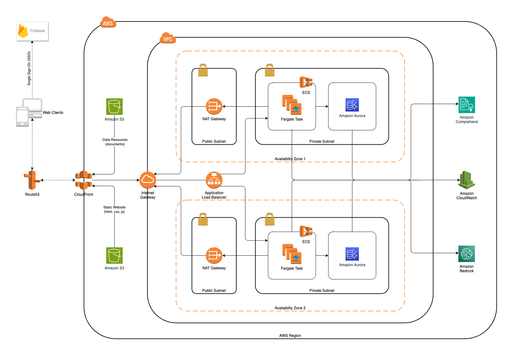

# avm-infra

Terraform modules for the Add Value Machine platform.

## Architecture

Architecture Diagram:



## Docs
- [Running the Terraform setup](docs/terraform-setup.md)
- [Deployment](docs/deployment.md)

### Prerequisites:

To get started you will need the following:

- [Terraform v1.5.3](https://developer.hashicorp.com/terraform/downloads)
- [AWS CLI 2.0](https://aws.amazon.com/cli/)
- A set of valid AWS Administrator or PowerUser Credentials

> Type `aws configure` and input the AWS credentials, including the region where you want to deploy the infrastructure
> stack into.

## Installation

Follow these instructions after installing both Terraform and AWS CLI.

1. Update the .env file with the shared data.

2. Initialize Terraform deployment. 

```terraform
$ sh deployment.sh
```

3. Inspect the output.

At the end of a successful apply, a set of variables and their values shall be output, to be used in further provisioning application environments.
