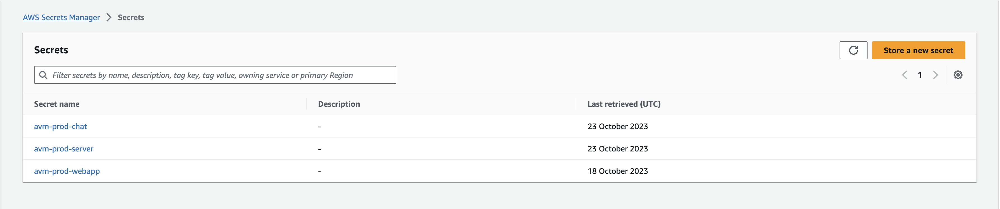
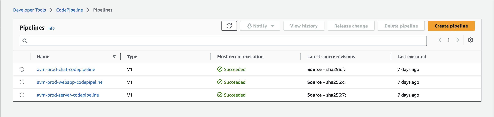
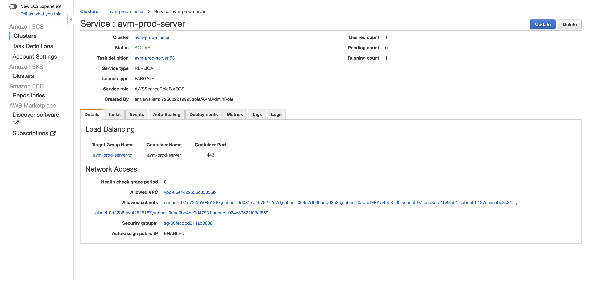
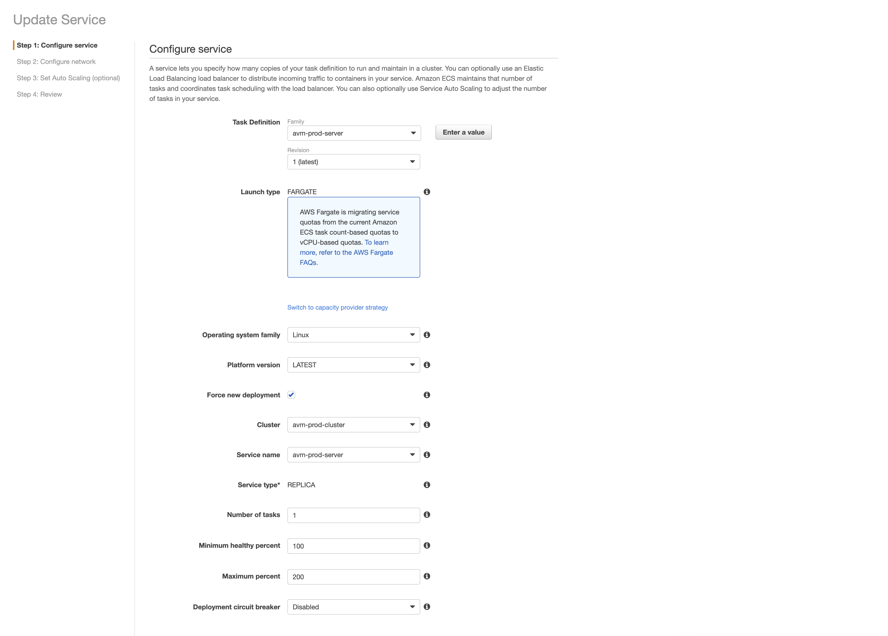

# Deployment

The following guide assumes you already have the Terraform setup completed. If you have not completed the Terraform setup, please see the [Terraform Setup](./terraform-setup.md) guide.

### Setting up the environment

The Terraform setup will create a set of Secrets Manager secrets that will be used by the AVM CI/CD to deploy the application.

The majority of secrets will be pre-filled by Terraform, but information such as Single Sign-On (SSO) credentials and the Google Drive token will need to be manually updated. 

> Secrets Manager entries marked as <REPLACE_ME> will need to be manually updated before deploying the application.



### CI/CD pipelines

The Terraform setup will create a set of CodePipeline pipelines that will be used to deploy the application in the AWS account.

The pipelines are configured to pull the latest Docker images from Elastic Container Registry (ECR). The Docker images are built and pushed to ECR by the AVM CI/CD.

> Pipelines will also need to be manually started after the initial setup. And whenever a new version of the application is released. 



## Manual deployment

In case you need to manually deploy the application, or the CodePipeline service is not available in your AWS region, you can use the following commands:

Authenticate to the ECR registry:
```bash
aws ecr get-login-password --region us-east-1 | docker login --username AWS --password-stdin 309847704252.dkr.ecr.us-east-1.amazonaws.com
```

Pull the latest Docker images from ECR:
- [309847704252.dkr.ecr.us-east-1.amazonaws.com/avm-chat:latest]()
- [309847704252.dkr.ecr.us-east-1.amazonaws.com/avm-webapp:latest]()
- [309847704252.dkr.ecr.us-east-1.amazonaws.com/avm-server:latest]()

```bash
docker pull 309847704252.dkr.ecr.us-east-1.amazonaws.com/avm-chat:latest
```

### Single page applications (SPA)

For the frontend applications, you can use the following commands to run the Docker image:

- Create a local environment file (`.env`) with the required credentials. You can pull the credentials from the Secrets Manager entries created by Terraform.
- Run the build script inside the container. Pass the `--env-file` and `--volume` flags to the `docker run` command.
```bash
docker run --env-file .env -v $(pwd)/build:/app/build <ECR_IMAGE_URI>
```
- This will create a `build` folder in the current directory with the static files for the application. You can then upload the files to an S3 bucket to host the application.
```bash
aws s3 sync build <S3_BUCKET> --delete
```
- Invalidate the CloudFront cache to ensure the latest version of the application is served.
```bash
aws cloudfront create-invalidation --distribution-id <CLOUDFRONT_DISTRIBUTION_ID> --paths "/*"
```
> Note: You will need to repeat the above process for each frontend application.

### Webserver container

For the webserver container, you can use the following steps to run the latest Docker image: 

- In the AWS console, find the ECS service under the ECS cluster created by Terraform.
- Select `Update` and tick the `Force new deployment` checkbox.
- This will trigger a new deployment of the application. ECS will pull the latest Docker image from ECR and deploy it to the ECS cluster.




