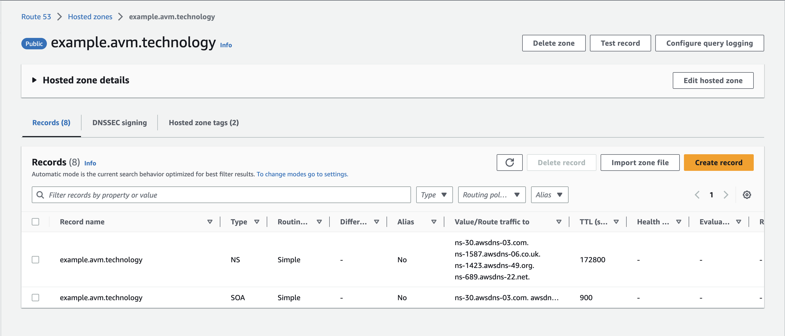

# Terraform Setup

The following guide assumes you have the required permissions (Power-User access) to an AWS account.

### Prerequisites:

To get started you will need the following:

- [Terraform v1.5.3](https://developer.hashicorp.com/terraform/downloads)
- [AWS CLI 2.0](https://aws.amazon.com/cli/)
- A set of valid AWS Administrator or Power-User Credentials

## Terraform Backend

Setting up the Terraform backend. We recommend manually creating an Amazon S3 bucket to store the Terraform state file, in the target AWS account. We also recommend enabling versioning on the bucket, to allow for easy rollbacks.

The following is an example of the Terraform backend configuration. The configuration should be added to the `versions.tf` file in the root of the Terraform project. Replace the bucket and region with the appropriate values for your environment.
```terraform
backend "s3" {
  region = "<AWS_REGION>"
  bucket = "<AWS_BUCKET_NAME>"
  key    = "terraform/terraform.tfstate"
}
```

For more information about setting this up see: https://developer.hashicorp.com/terraform/language/settings/backends/s3

## Terraform Configuration

The Terraform setup requires the following. Any additional configuration can be modified in the `variables.tf` file in the root of the Terraform project.
- **Root Domain Name**, for example: `avm.technology`
- **Terraform Workspace**, for example: `example` (this can be any value, but should be unique for each environment)

This should be added to the `variables.tf` file in the root of the Terraform project.

The **Root Domain Name** and the **Terraform Workspace** are used to create the Route53 Hosted Zone, based on the following structure `<WORKSPACE>.<ROOT_DOMAIN>`

Any additional paths will be appended to the Hosted Zone, for example: `api.<WORKSPACE>.<ROOT_DOMAIN>`

To create the Terraform workspace, run the following command:
```bash
terraform workspace new <WORKSPACE>
```

To select the Terraform workspace, run the following command:
```bash
terraform workspace select <WORKSPACE>
```

## Terraform Deployment

To deploy the Terraform project, run the following commands:

Initialize the Terraform backend by running:
```bash
terraform init
```

Create the Terraform plan by running:
```bash
terraform plan
```

If there are no errors, apply the Terraform plan by running:
```bash
terraform apply
```

## Manual Configuration

### Setting up the DNS

While the Terraform deployment is running, it will create a new Route53 Hosted Zone for the selected subdomain `<WORKSPACE>.<ROOT_DOMAIN>` (example: `example.avm.technology`)

The Route53 Hosted Zone will be then used by Terraform to create all the required DNS records for the application (Load-balancer, Cloudfront, SSL certificates, etc).

> The nameservers (NS) for the Route53 hosted zone will need to be manually added to the root domain DNS.



> Note: The Terraform deployment will fail if the NS records are not added to the root domain name. If this happens you will need to re-run the deployment.
